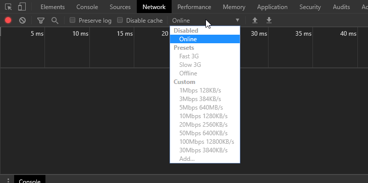
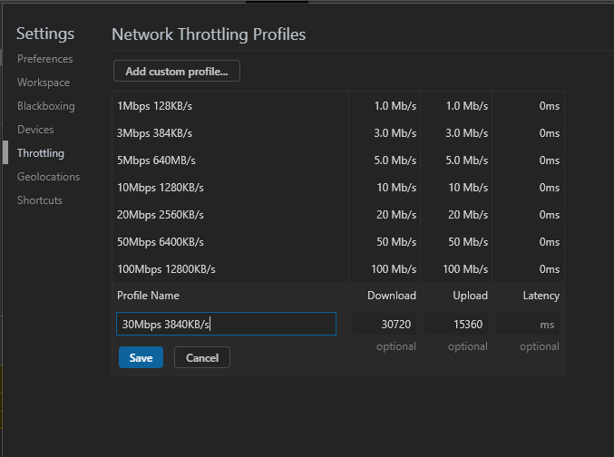
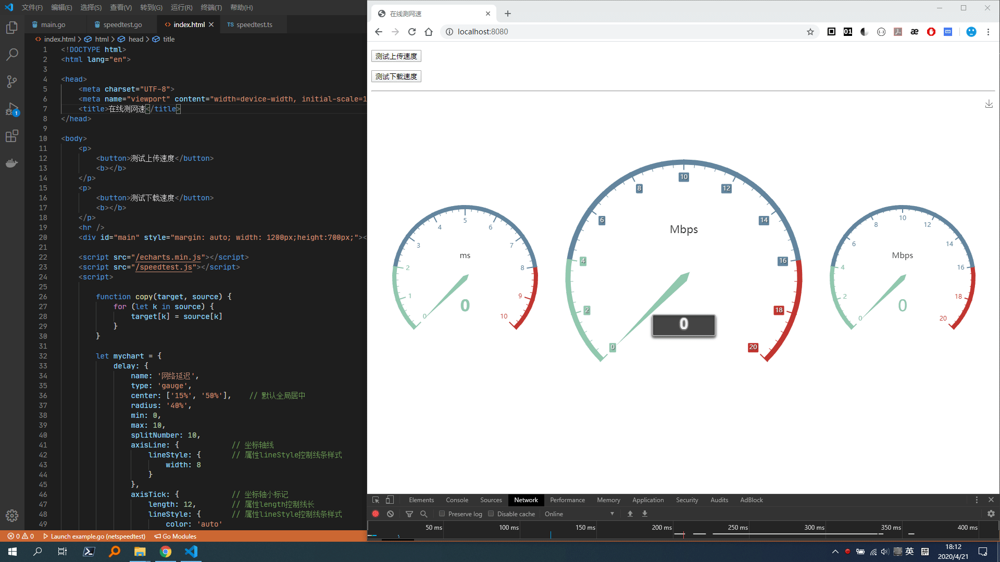

# netspeedtest

在线测网速工具

## 运行环境要求

- golang: version go1.14.2
- Google Chrome 浏览器

## 启动程序

1. 运行 run.bat 脚本，启动监听服务器

2. 在Chrome浏览器中打开网址 [http://localhost:8080/](http://localhost:8080/)

    - 打开浏览器的开发人员工具
    - 切换到网络选项卡，找到网速模拟选项

        

    - 最新版本的Chrome浏览器默认内置 Fast 3G, Slow 3G, Offline，可以选择进行体验
    - 点击 Custom - Add 可以自定义模拟网速
        - 输入框速率单位为：Kbps
        - 计算公式：目标带宽Mbps*1024，建议差异化设置上下行带宽进行体验
        - 如图示，模拟30Mbps带宽，设定全速率下行，50%速率上行

            

## 效果演示

